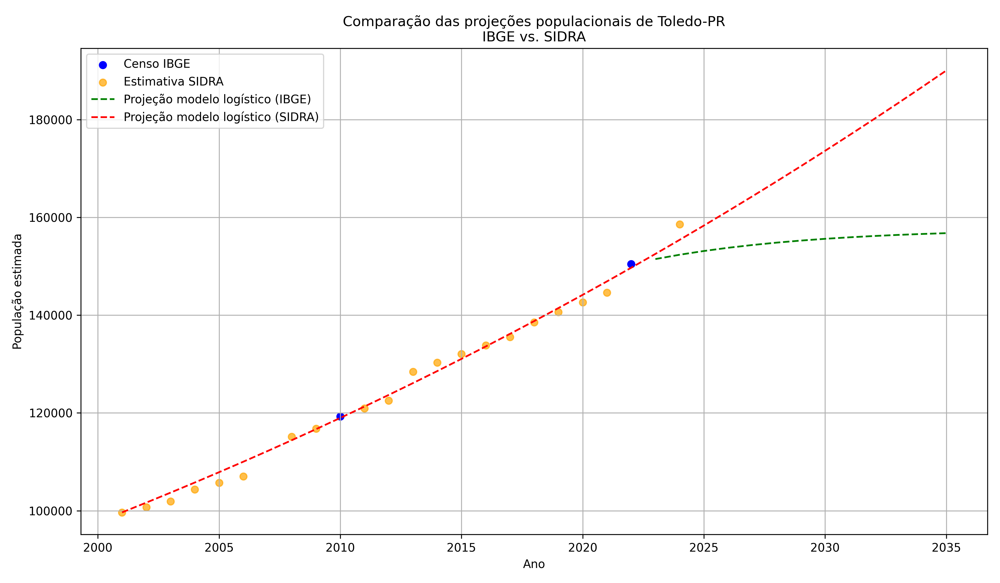

PT:
# 📈 Modelagem do crescimento populacional de Toledo-PR

Este projeto contém a implementação do estudo de modelagem do crescimento populacional da cidade de Toledo-PR, utilizando equação logística de Verhulst. Foram utilizadas duas fontes de dados oficiais, censos do IBGE e estimativas SIDRA, para comparar projeções e ajustar modelos matemáticos baseados em equações diferenciais ordinárias.

## 🛠 Tecnologias

- Python 3
- Pandas
- NumPy
- Matplotlib
- SciPy (curve_fit)

## 📂 Arquivos

- `populacao_toledo.ipynb`: notebook com toda a implementação, análise e geração dos gráficos.
- `estimativa_populacao_toledo.csv`: arquivo com as estimativas de população da cidade.
- `comparacao_projecoes_toledo.png`: gráfico comparando as projeções dos modelos baseados em IBGE e SIDRA.
- `Trabalho_EDO.pdf`: relatório completo do estudo, com fundamentação teórica, metodologia, resultados e conclusões.

## 📊 Resultados

| Fonte de dados | Taxa \(r\) | Capacidade \(K\) | Projeção 2035 |
|----------------|------------|------------------|---------------|
| IBGE (Censos)  | 0.01899    | 163.245          | ~156.800      |
| SIDRA (Estimativas)   | 0.022105   | 1.000.000        | ~190.000      |

O modelo baseado nas estimativas do SIDRA apresentou crescimento contínuo até 2035, enquanto o modelo com dados censitários indicou uma tendência de estabilização.

## 📌 Conclusão

Este estudo demonstra como uma abordagem matemática simples pode gerar projeções relevantes para o planejamento urbano. A escolha dos dados tem impacto significativo nos resultados e deve ser considerada com cuidado em modelagens populacionais.

EN:
# 📈 Population growth modeling of Toledo-PR

This project contains the implementation of a study on modeling the population growth of the city of Toledo-PR, using the Verhulst logistic equation. Two official data sources were used, IBGE censuses and SIDRA estimates, to compare projections and adjust mathematical models based on ordinary differential equations.

## 🛠 Technologies

- Python 3  
- Pandas  
- NumPy  
- Matplotlib  
- SciPy (curve_fit)  

## 📂 Files

- `populacao_toledo.ipynb`: notebook with the entire implementation, analysis, and generation of graphs.  
- `estimativa_populacao_toledo.csv`: file containing the city population estimates.  
- `comparacao_projecoes_toledo.png`: graph comparing the model projections based on IBGE and SIDRA data.  
- `Trabalho_EDO.pdf`: full report of the study, including theoretical background, methodology, results, and conclusions.  

## 📊 Results

| Data Source     | Rate \(r\) | Capacity \(K\) | 2035 Projection |
|-----------------|------------|---------------|-----------------|
| IBGE (Census)   | 0.01899    | 163,245       | ~156,800        |
| SIDRA (Estimates) | 0.022105  | 1,000,000     | ~190,000        |

The model based on SIDRA estimates showed continuous growth until 2035, while the model using census data indicated a stabilization trend.

## 📌 Conclusion

This study demonstrates how a simple mathematical approach can generate relevant projections for urban planning. The choice of data has a significant impact on the results and should be carefully considered in population modeling.
