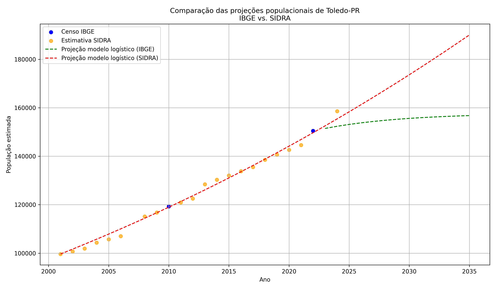

# 📈 Modelagem do crescimento populacional de Toledo-PR

Este projeto contém a implementação do estudo de modelagem do crescimento populacional da cidade de Toledo-PR, utilizando equação logística de Verhulst. Foram utilizadas duas fontes de dados oficiais, censos do IBGE e estimativas SIDRA, para comparar projeções e ajustar modelos matemáticos baseados em equações diferenciais ordinárias.

## Tecnologias

- Python 3
- Pandas
- NumPy
- Matplotlib
- SciPy (curve_fit)

## Arquivos

- `populacao_toledo.ipynb`: notebook com toda a implementação, análise e geração dos gráficos.
- `estimativa_populacao_toledo.csv`: arquivo com as estimativas de população da cidade.
- `comparacao_projecoes_toledo.png`: gráfico comparando as projeções dos modelos baseados em IBGE e SIDRA.
- `Trabalho_EDO.pdf`: relatório completo do estudo, com fundamentação teórica, metodologia, resultados e conclusões.

## Resultados

| Fonte de dados | Taxa \(r\) | Capacidade \(K\) | Projeção 2035 |
|----------------|------------|------------------|---------------|
| IBGE (Censos)  | 0.01899    | 163.245          | ~156.800      |
| SIDRA (Estimativas)   | 0.022105   | 1.000.000        | ~190.000      |

O modelo baseado nas estimativas do SIDRA apresentou crescimento contínuo até 2035, enquanto o modelo com dados censitários indicou uma tendência de estabilização.

## Conclusão

Este estudo demonstra como uma abordagem matemática simples pode gerar projeções relevantes para o planejamento urbano. A escolha dos dados tem impacto significativo nos resultados e deve ser considerada com cuidado em modelagens populacionais.
